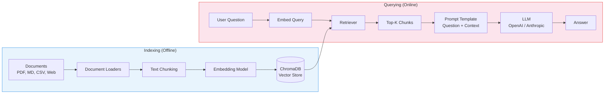
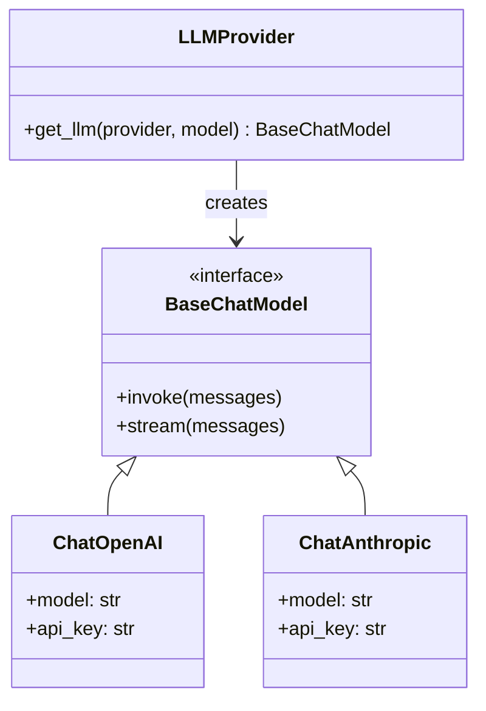
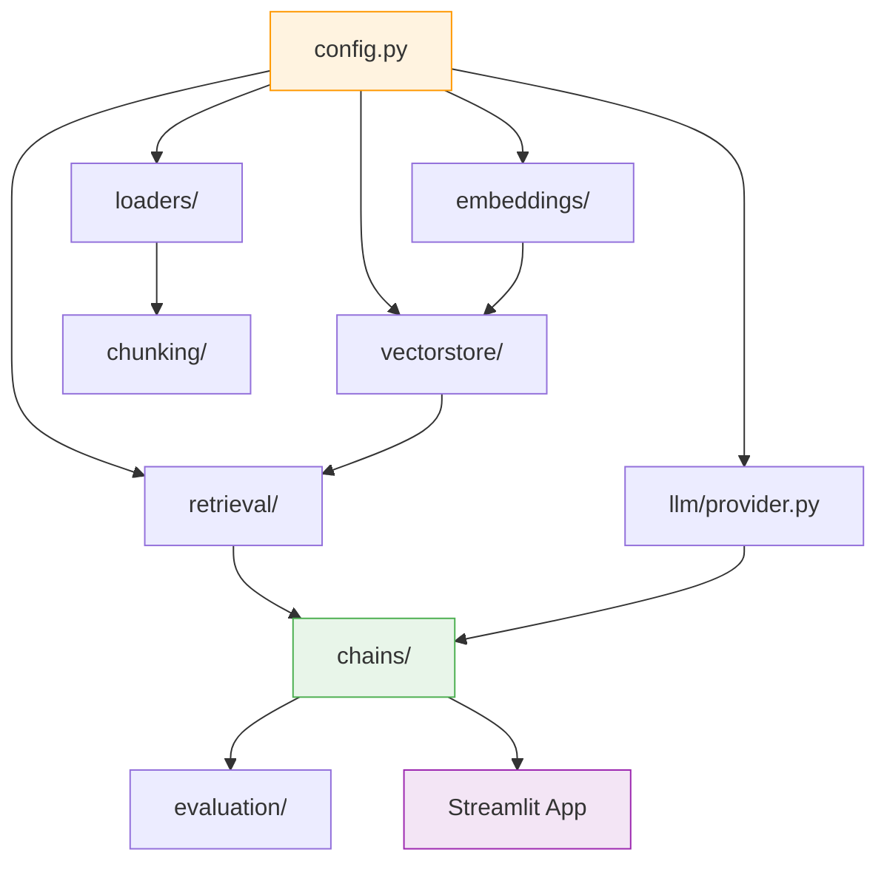

# Architecture

## RAG Pipeline Flow

```mermaid
flowchart LR
    subgraph Indexing["Indexing (Offline)"]
        A[Documents\nPDF, MD, CSV, Web] --> B[Document Loaders]
        B --> C[Text Chunking]
        C --> D[Embedding Model]
        D --> E[(ChromaDB\nVector Store)]
    end

    subgraph Querying["Querying (Online)"]
        F[User Question] --> G[Embed Query]
        G --> H[Retriever]
        E --> H
        H --> I[Top-K Chunks]
        I --> J[Prompt Template\nQuestion + Context]
        J --> K[LLM\nOpenAI / Anthropic]
        K --> L[Answer]
    end

    style Indexing fill:#e8f4fd,stroke:#1e88e5
    style Querying fill:#fce4ec,stroke:#e53935
```

## Swappable LLM Provider Pattern

```mermaid
classDiagram
    class BaseChatModel {
        <<interface>>
        +invoke(messages)
        +stream(messages)
    }

    class ChatOpenAI {
        +model: str
        +api_key: str
    }

    class ChatAnthropic {
        +model: str
        +api_key: str
    }

    class LLMProvider {
        +get_llm(provider, model) BaseChatModel
    }

    BaseChatModel <|-- ChatOpenAI
    BaseChatModel <|-- ChatAnthropic
    LLMProvider --> BaseChatModel : creates
```

## Component Dependency Graph

```mermaid
flowchart TD
    CONFIG[config.py] --> LOADERS[loaders/]
    CONFIG --> EMBEDDINGS[embeddings/]
    CONFIG --> VECTORSTORE[vectorstore/]
    CONFIG --> LLM[llm/provider.py]
    CONFIG --> RETRIEVAL[retrieval/]

    LOADERS --> CHUNKING[chunking/]
    EMBEDDINGS --> VECTORSTORE
    VECTORSTORE --> RETRIEVAL
    RETRIEVAL --> CHAINS[chains/]
    LLM --> CHAINS
    CHAINS --> EVAL[evaluation/]
    CHAINS --> APP[Streamlit App]

    style CONFIG fill:#fff3e0,stroke:#ff9800
    style CHAINS fill:#e8f5e9,stroke:#4caf50
    style APP fill:#f3e5f5,stroke:#9c27b0
```
